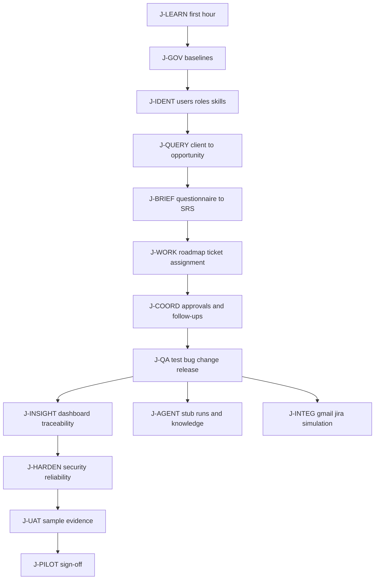

# Cross-module journeys

Use this file when you are testing a **business story** that spans desks, not a single module. Each journey lists the modules in order, the human gates, the data you must already have, and what is still stubbed.

Shared rules: [TESTING_CONVENTIONS.md](TESTING_CONVENTIONS.md). Module index: [README.md](README.md).

How to use a journey:

1. Complete F-SETUP for the first module.
2. Keep ids (client, query, project, ticket) in a notepad. The browser also stores some of them in localStorage ([`apps/web/src/lib/workspace.ts`](../../apps/web/src/lib/workspace.ts)).
3. At every **Human gate**, a named human decides. Do not use Agent (draft only) to approve.
4. If a step is Stubbed, test the stub contract and write “stub passed”, never “live integration passed”.

## Role path (header selector)

The Role dropdown is a **UI stub**. It does not log you in as another person. Server identity is still the default org/actor headers unless you call the API with different values.

| Header role | Typical journey use |
|---|---|
| Viewer | Confirm hidden create/approve on baselines |
| Contributor | Create drafts, submit, run most desks |
| Baseline Approver | Approve source baselines (MOD-000) |
| Admin | Same as approver on baselines; still not production Auth0 admin |
| Agent (draft only) | Negative tests: must not approve human gates |

ADR Approver and CR Approver exist in [`apps/web/src/lib/roles.ts`](../../apps/web/src/lib/roles.ts) but are **not** in the header selector.

---

## J-LEARN — First hour

**Audience:** anyone new. **Goal:** see the product without corrupting data.

| Step | Where | Module guide |
|---|---|---|
| 1 | Confirm API `GET /health/ready` | [MOD-010](../modules/MOD-010/E2E_GUIDE.md) |
| 2 | Open Dashboard `/` | [MOD-450](../modules/MOD-450/E2E_GUIDE.md) |
| 3 | Press ⌘K and jump to Clients | Shared chrome |
| 4 | Open My Work and Inbox (may be empty) | [MOD-330](../modules/MOD-330/E2E_GUIDE.md), [MOD-210](../modules/MOD-210/E2E_GUIDE.md) |
| 5 | Open Audit Logs | [MOD-040](../modules/MOD-040/E2E_GUIDE.md) |
| 6 | Toggle theme; ignore header Create / AI / Bell (no action) | Conventions |

**Human gate:** none. **Stubbed:** header identity, command palette (module search only).

---

## J-GOV — Governance register

**Depends on:** MOD-010 stack. **Creates:** a draft then approved source baseline and an ADR.

Follow [MOD-000](../modules/MOD-000/E2E_GUIDE.md) F-HAPPY.

**Human gate:** Approve baseline; Accept ADR. Agents must fail.

**Next:** J-IDENT or skip to J-QUERY if identity seed already exists.

---

## J-IDENT — Organization, users, access, capacity

| Step | Desk | Module |
|---|---|---|
| 1 | Users & Teams — Create user, Create team | [MOD-100](../modules/MOD-100/E2E_GUIDE.md) |
| 2 | Roles & Permissions — Create role, permission, grant | [MOD-120](../modules/MOD-120/E2E_GUIDE.md) |
| 3 | Skills & Capacity — Create skill, allocation | [MOD-130](../modules/MOD-130/E2E_GUIDE.md) |
| 4 | API only: local session / MFA challenge | [MOD-110](../modules/MOD-110/E2E_GUIDE.md) |
| 5 | API only: config version draft → approve → activate | [MOD-140](../modules/MOD-140/E2E_GUIDE.md) |

**Human gate:** activating live workflow config (MOD-140) is an authorized human action.

**Stubbed:** Auth0 login page does not exist. RLS is not proven by SQLite tests.

**Dependency for later journeys:** you can keep using the default org/actor; creating extra users does not change the header session.

---

## J-QUERY — Client inquiry to opportunity

**Depends on:** running API (client create does not require a baseline).

| Step | Desk | Module |
|---|---|---|
| 1 | Clients — Create client | [MOD-200](../modules/MOD-200/E2E_GUIDE.md) |
| 2 | Queries — Save inquiry | [MOD-210](../modules/MOD-210/E2E_GUIDE.md) |
| 3 | Transition received → classified → qualifying → qualified | MOD-210 |
| 4 | Messages — Open conversation, Draft message | [MOD-220](../modules/MOD-220/E2E_GUIDE.md) |
| 5 | Approve sensitive draft if shown, then Send | MOD-220 |
| 6 | Opportunities — convert qualified query | MOD-210 |
| 7 | Inbox — confirm the query appears | MOD-210 / 440 / 510 |

**Human gate:** sending client-facing content may require message approval.

**Planned / nonfunctional if present:** Import with AI, Generate clarifying questions.

**Keep:** `client_id`, `query_id` (also stored as `masms.workspace.queryId`).

---

## J-BRIEF — Questionnaire to project SRS

**Depends on:** J-QUERY (`query_id`). Optional: a document template later.

| Step | Desk | Module |
|---|---|---|
| 1 | Requirements — Publish questionnaire linked to the query | [MOD-230](../modules/MOD-230/E2E_GUIDE.md) |
| 2 | Answer questions — Save answers & score | MOD-230 |
| 3 | Create clarifications for gaps | MOD-230 |
| 4 | Create & approve brief | MOD-230 — **human**; UI combines create+approve |
| 5 | Projects — Create project | [MOD-240](../modules/MOD-240/E2E_GUIDE.md) |
| 6 | Draft requirement, version, criterion, approve version | MOD-240 |
| 7 | Create-and-approve SRS | MOD-240 — **human**; UI combines create+approve |
| 8 | Documents — Create document, simulated scan, mark available | [MOD-250](../modules/MOD-250/E2E_GUIDE.md) |

**Human gates:** brief approval, requirement version approval, SRS approval. Do not treat combined buttons as “the system auto-approved.” A human clicked them.

**Stubbed:** real file upload / antivirus / S3.

**Keep:** `project_id` (`masms.workspace.projectId`).

---

## J-WORK — Roadmap, ticket, assignment

**Depends on:** `project_id` from J-BRIEF.

| Step | Desk | Module |
|---|---|---|
| 1 | Roadmaps — Add phase, milestone, approve/complete | [MOD-260](../modules/MOD-260/E2E_GUIDE.md) |
| 2 | Tickets — Create ticket, Prepare & mark Ready | [MOD-300](../modules/MOD-300/E2E_GUIDE.md) |
| 3 | Walk allowed transitions toward done | MOD-300 / [MOD-320](../modules/MOD-320/E2E_GUIDE.md) |
| 4 | Assignment API or ticket ownership actions | [MOD-310](../modules/MOD-310/E2E_GUIDE.md) |
| 5 | Invalid transition must fail | MOD-320 |
| 6 | Reopen done work with evidence (human) | MOD-300 |

**Human gate:** reopen of completed work; milestone approval.

**Planned:** ticket board, timeline drawer, roadmap dependency graph.

**Keep:** `ticket_id`.

---

## J-COORD — Approvals and follow-ups

**Depends on:** an entity version (requirement, SRS, or ticket) from J-BRIEF / J-WORK.

| Step | Desk | Module |
|---|---|---|
| 1 | Approvals — Submit request bound to **exact version** | [MOD-330](../modules/MOD-330/E2E_GUIDE.md) |
| 2 | Attach evidence; Approve or Reject with reason | MOD-330 |
| 3 | My Work — pending approval appears | MOD-330 |
| 4 | Follow-ups — Open follow-up on the query | [MOD-340](../modules/MOD-340/E2E_GUIDE.md) |
| 5 | Add closure evidence; Close or Process overdue | MOD-340 |
| 6 | Notifications list may stay empty until MOD-440 create | [MOD-440](../modules/MOD-440/E2E_GUIDE.md) |

**Human gate:** every approval decision. Rejection/withdraw needs a reason.

**Stubbed:** reminder emails and Temporal timers.

---

## J-QA — Test, bug, change, release

**Depends on:** `project_id`, preferably a requirement and ticket.

| Step | Desk | Module |
|---|---|---|
| 1 | Test Cases — Create & approve, link coverage, simulated run | [MOD-400](../modules/MOD-400/E2E_GUIDE.md) |
| 2 | Bugs — Create, reject or reopen loop, inspect release gate | [MOD-410](../modules/MOD-410/E2E_GUIDE.md) |
| 3 | Change Requests — Create & submit, impact, decide | [MOD-420](../modules/MOD-420/E2E_GUIDE.md) |
| 4 | Releases — Create & submit, human production approval | [MOD-430](../modules/MOD-430/E2E_GUIDE.md) |
| 5 | Deployments — Start deployment **record** | MOD-430 |

**Human gates:** test-case approval (even if combined), known-issue acceptance, CR decision, production release approval. **Do not** treat Start deployment as a live production ship.

**Stubbed:** AWS deploy, rollback automation.

---

## J-INSIGHT — Dashboard, reporting, traceability

**Depends on:** data from earlier journeys (empty dashboard is still a valid first-hour result).

| Step | Desk | Module |
|---|---|---|
| 1 | Dashboard refresh, KPI cards, attention queue, Open Queries | [MOD-450](../modules/MOD-450/E2E_GUIDE.md) |
| 2 | Insights — search, save filter, create export | MOD-450 |
| 3 | Traceability — must-have links, manifest, seal, export | [MOD-460](../modules/MOD-460/E2E_GUIDE.md) |
| 4 | Audit Logs — append-only list | [MOD-040](../modules/MOD-040/E2E_GUIDE.md) |

**Human gate:** sealing/exporting evidence packs is a controlled action; treat as sensitive.

---

## J-AGENT — Stub agent runtime and knowledge

**Depends on:** org actor; project id optional.

| Step | Desk | Module |
|---|---|---|
| 1 | Agents — read catalog codes | [MOD-360](../modules/MOD-360/E2E_GUIDE.md) |
| 2 | Agent Runs — Start run (optionally force low confidence) | MOD-360 |
| 3 | Confirm stub output and review_required when confidence is low | MOD-360 |
| 4 | Workflows — Start instance (Temporal stub id) | [MOD-350](../modules/MOD-350/E2E_GUIDE.md) |
| 5 | Knowledge — Publish item, stub search citations | [MOD-370](../modules/MOD-370/E2E_GUIDE.md) |

**Human gate:** low-confidence review; activating knowledge in the target design. Combined Publish is a shortcut.

**Stubbed:** live LangGraph, LLM provider, pgvector, Temporal workers. Never record this journey as “real AI passed”.

---

## J-INTEG — Integration simulations

| Step | Desk | Module |
|---|---|---|
| 1 | Integrations — create/activate connection, simulated webhook/inbox | [MOD-500](../modules/MOD-500/E2E_GUIDE.md) |
| 2 | Gmail — simulated inbound and draft/send path | [MOD-510](../modules/MOD-510/E2E_GUIDE.md) |
| 3 | Jira — simulated push / conflict / retry | [MOD-520](../modules/MOD-520/E2E_GUIDE.md) |

**Human gate:** Gmail send of client content (approval on the combined action).

**Stubbed:** Google API, Jira API, SNS/SQS, OAuth to real providers.

---

## J-HARDEN — Security and reliability records

| Step | Desk | Module |
|---|---|---|
| 1 | Security — training policy, incident, backup **record**, legal hold list | [MOD-600](../modules/MOD-600/E2E_GUIDE.md) |
| 2 | Reliability — SLO cards, replay record, DR runbook record | [MOD-610](../modules/MOD-610/E2E_GUIDE.md) |

These desks persist **evidence rows**. They do not back up or restore a real production database. Do not click through them as if you recovered production.

---

## J-UAT — Sample projects and evidence registry

| Step | Desk | Module |
|---|---|---|
| 1 | UAT — Seed SAMPLE-A / B / C if the gate allows | [MOD-620](../modules/MOD-620/E2E_GUIDE.md) |
| 2 | Record evaluation and acceptance evidence | MOD-620 |

This stores UAT rows. It does **not** run Playwright. Attach screenshots from the journeys above as the real evidence.

**Human gate:** acceptance evidence sign-off.

---

## J-PILOT — Controlled pilot records

**Depends on:** J-UAT plus security/reliability records as your process requires.

| Step | Desk | Module |
|---|---|---|
| 1 | Pilot — Create plan, Add user, Record test | [MOD-630](../modules/MOD-630/E2E_GUIDE.md) |
| 2 | Review readiness gates | MOD-630 |
| 3 | Sign-off | **Human only** |

Agents must not finalize production release, rollback, or pilot sign-off. If the UI shows a sign-off button, a responsible human still owns the decision.

---

## Human approval checklist (all journeys)

| Decision | Journey | Module |
|---|---|---|
| Source baseline approve | J-GOV | MOD-000 |
| ADR accept | J-GOV | MOD-000 |
| Config activate | J-IDENT | MOD-140 |
| Client message send (when classified sensitive) | J-QUERY | MOD-220 |
| Requirements brief | J-BRIEF | MOD-230 |
| Requirement version / SRS | J-BRIEF | MOD-240 |
| Milestone approve | J-WORK | MOD-260 |
| Ticket reopen | J-WORK | MOD-300 |
| Exact-version approval request | J-COORD | MOD-330 |
| Test case approve | J-QA | MOD-400 |
| Known issue / CR / production release | J-QA | MOD-410 / 420 / 430 |
| Agent low-confidence review | J-AGENT | MOD-360 |
| UAT acceptance | J-UAT | MOD-620 |
| Pilot / production sign-off | J-PILOT | MOD-630 |

---

## Suggested full-program day

For a complete manual E2E session (one tester, local stub stack):

1. J-LEARN (15 min)
2. J-GOV (20 min)
3. J-IDENT (20 min)
4. J-QUERY + J-BRIEF (45 min)
5. J-WORK + J-COORD (40 min)
6. J-QA + J-INSIGHT (40 min)
7. J-AGENT + J-INTEG (30 min) — record as stub tests
8. J-HARDEN + J-UAT + J-PILOT (30 min) — records only; human sign-off last

Stop and file a blocker if any human gate is missing, if another organization’s data appears, or if a stub is reported as a live provider success.
