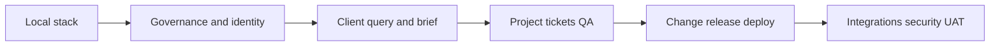

# MASMS End-to-End Testing Handbook

This handbook tells every kind of user how to understand and test MASMS: what each module is for, which screen to open, which button to press, which API and file sit behind it, what should happen, and what is still stubbed or planned.

Start here. Then open one module guide, or follow a [cross-module journey](CROSS_MODULE_JOURNEYS.md).

Shared rules: [TESTING_CONVENTIONS.md](TESTING_CONVENTIONS.md). Coverage check: [COVERAGE.md](COVERAGE.md).

## How to use this handbook

1. Start the local stack using the commands in the conventions file.
2. Open the web app and confirm the sidebar loads.
3. Pick a **journey** if you are learning the business, or a **module** if you are testing one desk.
4. On each step, record pass, fail, skip, or blocked. Do not mark a stub as a live integration pass.
5. Keep human-only gates human-only.



## Audiences

| If you are… | Read this first | Then |
|---|---|---|
| New to MASMS | This page + journey J-LEARN | One desk at a time |
| QA | Conventions + module pass/fail checklists | Negative and tenant flows |
| Developer | Module “API, data, and files” | `tests/unit` and `tests/integration` |
| Product / owner | Status honesty + human gates | Remaining Planned items |

## Environment at a glance

| Layer | Local entry | Notes |
|---|---|---|
| Web | `http://localhost:3000` | Next.js desks in `apps/web` |
| API | `http://127.0.0.1:8000/docs` | FastAPI `/api/v1/*` |
| Database | Postgres `masms` | Alembic in `migrations/versions` |
| Identity | Header stub | Not Auth0 login |
| Agents | `/agents`, `/agent-runs` | LangGraph adapter is a stub |
| Workflows | `/workflows` | Temporal adapter is a stub |

Default org/actor IDs are listed in [TESTING_CONVENTIONS.md](TESTING_CONVENTIONS.md).

## Status of the product you are testing

| Band | Modules | What “Done” means here |
|---|---|---|
| Phase 0–2 plus work desks through MOD-340 | MOD-000–340 | Business APIs and desks exist; local header identity and opt-in Auth0 are available |
| Orchestration and later | MOD-350–630 | Registries/desks remain; first Temporal/LLM/RAG and Gmail/Jira sandbox paths are opt-in, not production proof |

Playwright smoke automation is in `apps/web/e2e` and runs with:

```powershell
npm --prefix apps/web run e2e:smoke
```

It covers local-header shell journeys and the Auth0 entry page. Authenticated Auth0 automation
is conditional on approved sandbox storage state. These guides remain the deeper manual/API E2E
method; MOD-620 stores UAT evidence records rather than driving the browser itself.

## Module index

### Phase 0 — Governance and foundation

| Module | Guide | Desk / surface | One-line purpose |
|---|---|---|---|
| MOD-000 | [E2E_GUIDE](../modules/MOD-000/E2E_GUIDE.md) | `/governance/baselines`, `/architecture-decisions` | Source baselines, ADRs, governance CRs |
| MOD-010 | [E2E_GUIDE](../modules/MOD-010/E2E_GUIDE.md) | Repo / CI / local commands | Clone, install, run, same checks as CI |
| MOD-020 | [E2E_GUIDE](../modules/MOD-020/E2E_GUIDE.md) | Kernel library (no desk) | IDs, tenant, errors, outbox, pagination |
| MOD-030 | [E2E_GUIDE](../modules/MOD-030/E2E_GUIDE.md) | Env files / deploy workflows | Environments, secrets contract, deploy skeleton |
| MOD-040 | [E2E_GUIDE](../modules/MOD-040/E2E_GUIDE.md) | `/audit-logs`, health | Audit, activity, health, outbox relay |

### Phase 1 — Identity, organization, and configuration

| Module | Guide | Desk / surface | One-line purpose |
|---|---|---|---|
| MOD-100 | [E2E_GUIDE](../modules/MOD-100/E2E_GUIDE.md) | `/users` | Organizations, humans, agents, teams |
| MOD-110 | [E2E_GUIDE](../modules/MOD-110/E2E_GUIDE.md) | API `/auth` (no login page) | Sessions, MFA, invitations (local provider) |
| MOD-120 | [E2E_GUIDE](../modules/MOD-120/E2E_GUIDE.md) | `/roles` | Permissions, membership, access checks |
| MOD-130 | [E2E_GUIDE](../modules/MOD-130/E2E_GUIDE.md) | `/capacity` | Skills, allocations, calendars |
| MOD-140 | [E2E_GUIDE](../modules/MOD-140/E2E_GUIDE.md) | API `/config` | Versioned operational rules |

### Phase 2 — Client, query, and requirements

| Module | Guide | Desk / surface | One-line purpose |
|---|---|---|---|
| MOD-200 | [E2E_GUIDE](../modules/MOD-200/E2E_GUIDE.md) | `/clients` | Clients and contacts |
| MOD-210 | [E2E_GUIDE](../modules/MOD-210/E2E_GUIDE.md) | `/queries`, `/opportunities`, `/inbox` | Inquiries to qualified opportunities |
| MOD-220 | [E2E_GUIDE](../modules/MOD-220/E2E_GUIDE.md) | `/comms` | Conversations, drafts, send |
| MOD-230 | [E2E_GUIDE](../modules/MOD-230/E2E_GUIDE.md) | `/requirements` | Questionnaires, completeness, brief |
| MOD-240 | [E2E_GUIDE](../modules/MOD-240/E2E_GUIDE.md) | `/projects` | Projects, requirement versions, SRS |
| MOD-250 | [E2E_GUIDE](../modules/MOD-250/E2E_GUIDE.md) | `/documents` | Documents, versions, scan stub |
| MOD-260 | [E2E_GUIDE](../modules/MOD-260/E2E_GUIDE.md) | `/roadmap` | Phases and milestones |

### Phase 3 — Work, approvals, agents

| Module | Guide | Desk / surface | One-line purpose |
|---|---|---|---|
| MOD-300 | [E2E_GUIDE](../modules/MOD-300/E2E_GUIDE.md) | `/tickets` | Tickets, readiness, done, reopen |
| MOD-310 | [E2E_GUIDE](../modules/MOD-310/E2E_GUIDE.md) | Ticket desk + `/api/v1/assignments` | Skill/capacity assignment |
| MOD-320 | [E2E_GUIDE](../modules/MOD-320/E2E_GUIDE.md) | Ticket transitions + `/status-engine` | Configurable status engine |
| MOD-330 | [E2E_GUIDE](../modules/MOD-330/E2E_GUIDE.md) | `/approvals`, `/my-work` | Human approval gates |
| MOD-340 | [E2E_GUIDE](../modules/MOD-340/E2E_GUIDE.md) | `/follow-ups` | Follow-ups, overdue, reminders |
| MOD-350 | [E2E_GUIDE](../modules/MOD-350/E2E_GUIDE.md) | `/workflows` | Temporal orchestrator **stub** |
| MOD-360 | [E2E_GUIDE](../modules/MOD-360/E2E_GUIDE.md) | `/agents`, `/agent-runs` | LangGraph runtime **stub** |
| MOD-370 | [E2E_GUIDE](../modules/MOD-370/E2E_GUIDE.md) | `/knowledge` | Knowledge registry and stub RAG |

### Phase 4 — Quality, change, release, reporting

| Module | Guide | Desk / surface | One-line purpose |
|---|---|---|---|
| MOD-400 | [E2E_GUIDE](../modules/MOD-400/E2E_GUIDE.md) | `/test-cases` | Test cases, runs, coverage |
| MOD-410 | [E2E_GUIDE](../modules/MOD-410/E2E_GUIDE.md) | `/bugs` | Bug lifecycle and release gate |
| MOD-420 | [E2E_GUIDE](../modules/MOD-420/E2E_GUIDE.md) | `/change-requests` | Change requests and impact |
| MOD-430 | [E2E_GUIDE](../modules/MOD-430/E2E_GUIDE.md) | `/releases`, `/deployments` | Release package and deploy records |
| MOD-440 | [E2E_GUIDE](../modules/MOD-440/E2E_GUIDE.md) | `/notifications`, `/my-work` | Notification inbox (delivery stub) |
| MOD-450 | [E2E_GUIDE](../modules/MOD-450/E2E_GUIDE.md) | `/`, `/insights` | Dashboard, search, exports |
| MOD-460 | [E2E_GUIDE](../modules/MOD-460/E2E_GUIDE.md) | `/traceability`, `/audit-logs` | Traceability manifests and exports |

### Phase 5 — Integrations

| Module | Guide | Desk / surface | One-line purpose |
|---|---|---|---|
| MOD-500 | [E2E_GUIDE](../modules/MOD-500/E2E_GUIDE.md) | `/integrations` | Connection, webhook, inbox **simulation** |
| MOD-510 | [E2E_GUIDE](../modules/MOD-510/E2E_GUIDE.md) | `/gmail` | Gmail mapping **simulation** |
| MOD-520 | [E2E_GUIDE](../modules/MOD-520/E2E_GUIDE.md) | `/jira` | Jira issue **simulation** |

### Phase 6 — Security, reliability, UAT, pilot

| Module | Guide | Desk / surface | One-line purpose |
|---|---|---|---|
| MOD-600 | [E2E_GUIDE](../modules/MOD-600/E2E_GUIDE.md) | `/security` | Hardening records, incidents, backup rows |
| MOD-610 | [E2E_GUIDE](../modules/MOD-610/E2E_GUIDE.md) | `/reliability` | SLO cards, replay, DR runbooks |
| MOD-620 | [E2E_GUIDE](../modules/MOD-620/E2E_GUIDE.md) | `/uat` | Sample projects and UAT evidence registry |
| MOD-630 | [E2E_GUIDE](../modules/MOD-630/E2E_GUIDE.md) | `/pilot` | Pilot plan and sign-off records |

## Route map (every user-facing page)

| Route | Module | Guide |
|---|---|---|
| `/` | MOD-450 | [MOD-450](../modules/MOD-450/E2E_GUIDE.md) |
| `/insights` | MOD-450 | [MOD-450](../modules/MOD-450/E2E_GUIDE.md) |
| `/my-work` | MOD-330 / 340 / 440 | [MOD-330](../modules/MOD-330/E2E_GUIDE.md) |
| `/inbox` | MOD-210 / 440 / 510 | [MOD-210](../modules/MOD-210/E2E_GUIDE.md) |
| `/clients` | MOD-200 | [MOD-200](../modules/MOD-200/E2E_GUIDE.md) |
| `/queries` | MOD-210 | [MOD-210](../modules/MOD-210/E2E_GUIDE.md) |
| `/opportunities` | MOD-210 | [MOD-210](../modules/MOD-210/E2E_GUIDE.md) |
| `/comms` | MOD-220 | [MOD-220](../modules/MOD-220/E2E_GUIDE.md) |
| `/projects` | MOD-240 | [MOD-240](../modules/MOD-240/E2E_GUIDE.md) |
| `/requirements` | MOD-230 | [MOD-230](../modules/MOD-230/E2E_GUIDE.md) |
| `/roadmap` | MOD-260 | [MOD-260](../modules/MOD-260/E2E_GUIDE.md) |
| `/tickets` | MOD-300 / 310 / 320 | [MOD-300](../modules/MOD-300/E2E_GUIDE.md) |
| `/documents` | MOD-250 | [MOD-250](../modules/MOD-250/E2E_GUIDE.md) |
| `/follow-ups` | MOD-340 | [MOD-340](../modules/MOD-340/E2E_GUIDE.md) |
| `/approvals` | MOD-330 | [MOD-330](../modules/MOD-330/E2E_GUIDE.md) |
| `/test-cases` | MOD-400 | [MOD-400](../modules/MOD-400/E2E_GUIDE.md) |
| `/bugs` | MOD-410 | [MOD-410](../modules/MOD-410/E2E_GUIDE.md) |
| `/agents` | MOD-360 | [MOD-360](../modules/MOD-360/E2E_GUIDE.md) |
| `/agent-runs` | MOD-360 | [MOD-360](../modules/MOD-360/E2E_GUIDE.md) |
| `/knowledge` | MOD-370 | [MOD-370](../modules/MOD-370/E2E_GUIDE.md) |
| `/releases` | MOD-430 | [MOD-430](../modules/MOD-430/E2E_GUIDE.md) |
| `/deployments` | MOD-430 | [MOD-430](../modules/MOD-430/E2E_GUIDE.md) |
| `/governance/baselines` | MOD-000 | [MOD-000](../modules/MOD-000/E2E_GUIDE.md) |
| `/governance/baselines/new` | MOD-000 | [MOD-000](../modules/MOD-000/E2E_GUIDE.md) |
| `/governance/baselines/[id]` | MOD-000 | [MOD-000](../modules/MOD-000/E2E_GUIDE.md) |
| `/architecture-decisions` | MOD-000 | [MOD-000](../modules/MOD-000/E2E_GUIDE.md) |
| `/change-requests` | MOD-420 | [MOD-420](../modules/MOD-420/E2E_GUIDE.md) |
| `/traceability` | MOD-460 | [MOD-460](../modules/MOD-460/E2E_GUIDE.md) |
| `/audit-logs` | MOD-040 / 460 | [MOD-040](../modules/MOD-040/E2E_GUIDE.md) |
| `/users` | MOD-100 | [MOD-100](../modules/MOD-100/E2E_GUIDE.md) |
| `/roles` | MOD-100 / 120 | [MOD-120](../modules/MOD-120/E2E_GUIDE.md) |
| `/capacity` | MOD-130 | [MOD-130](../modules/MOD-130/E2E_GUIDE.md) |
| `/workflows` | MOD-350 | [MOD-350](../modules/MOD-350/E2E_GUIDE.md) |
| `/integrations` | MOD-500 | [MOD-500](../modules/MOD-500/E2E_GUIDE.md) |
| `/gmail` | MOD-510 | [MOD-510](../modules/MOD-510/E2E_GUIDE.md) |
| `/jira` | MOD-520 | [MOD-520](../modules/MOD-520/E2E_GUIDE.md) |
| `/notifications` | MOD-440 | [MOD-440](../modules/MOD-440/E2E_GUIDE.md) |
| `/security` | MOD-600 | [MOD-600](../modules/MOD-600/E2E_GUIDE.md) |
| `/reliability` | MOD-610 | [MOD-610](../modules/MOD-610/E2E_GUIDE.md) |
| `/uat` | MOD-620 | [MOD-620](../modules/MOD-620/E2E_GUIDE.md) |
| `/pilot` | MOD-630 | [MOD-630](../modules/MOD-630/E2E_GUIDE.md) |

Navigation source: [`apps/web/src/lib/navigation.ts`](../../apps/web/src/lib/navigation.ts).

## API prefixes

All business routers mount under `/api/v1` in [`apps/api/src/masms_api/main.py`](../../apps/api/src/masms_api/main.py).

| Prefix | Module |
|---|---|
| `/governance` | MOD-000 |
| `/observability` | MOD-040 |
| `/identity` | MOD-100 |
| `/auth` | MOD-110 |
| `/access` | MOD-120 |
| `/capacity` | MOD-130 |
| `/config` | MOD-140 |
| `/clients` | MOD-200 |
| `/queries` | MOD-210 |
| `/comms` | MOD-220 |
| `/requirements` | MOD-230 |
| `/projects` | MOD-240 |
| `/documents` | MOD-250 |
| `/roadmap` | MOD-260 |
| `/tickets` | MOD-300 |
| `/assignments` | MOD-310 |
| `/status-engine` | MOD-320 |
| `/approvals` | MOD-330 |
| `/follow-ups` | MOD-340 |
| `/orchestrator` | MOD-350 |
| `/agent-runtime` | MOD-360 |
| `/knowledge` | MOD-370 |
| `/test-cases` | MOD-400 |
| `/bugs` | MOD-410 |
| `/change-control` | MOD-420 |
| `/releases` | MOD-430 |
| `/notifications` | MOD-440 |
| `/insights` | MOD-450 |
| `/traceability` | MOD-460 |
| `/integrations` | MOD-500 |
| `/gmail` | MOD-510 |
| `/jira` | MOD-520 |
| `/security` | MOD-600 |
| `/reliability` | MOD-610 |
| `/uat` | MOD-620 |
| `/pilot` | MOD-630 |

MOD-010 and MOD-030 have no business CRUD router.

## Suggested test order (data dependencies)

1. MOD-010 local stack, then MOD-020/030/040 health and audit.
2. MOD-000 baseline (optional for later desks, required for governance UAT).
3. MOD-100 users/teams, MOD-120 roles, MOD-130 skills.
4. MOD-200 client → MOD-210 query → MOD-220 message.
5. MOD-230 questionnaire/brief → MOD-240 project/SRS → MOD-250 document → MOD-260 roadmap.
6. MOD-300 ticket → MOD-330 approval and MOD-340 follow-up.
7. MOD-400 test case → MOD-410 bug → MOD-420 change → MOD-430 release.
8. MOD-450 dashboard, MOD-460 traceability, MOD-440 notifications.
9. MOD-350/360/370 stubs, then MOD-500/510/520 simulations.
10. MOD-600/610 records, then MOD-620 UAT registry, then MOD-630 pilot records (human sign-off only).

## Related product docs

- Module READMEs and verification logs: [`Docs/modules/`](../modules/)
- Requirement map: [`Docs/governance/REQUIREMENT_MODULE_MAP.md`](../governance/REQUIREMENT_MODULE_MAP.md)
- Implementation plan: [`MASMS_CURSOR_MODULE_WISE_IMPLEMENTATION_PLAN.md`](../../MASMS_CURSOR_MODULE_WISE_IMPLEMENTATION_PLAN.md)
